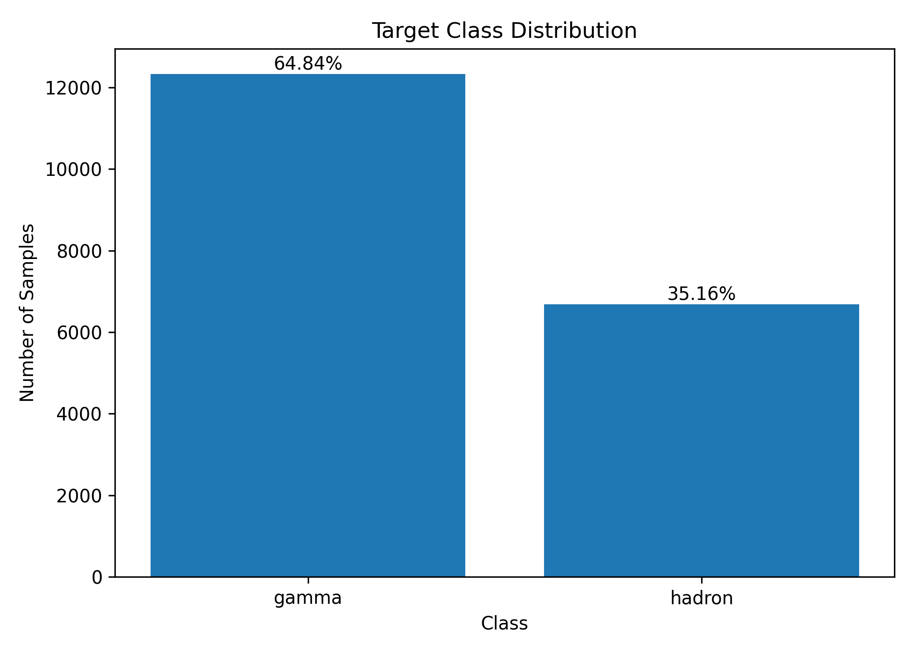
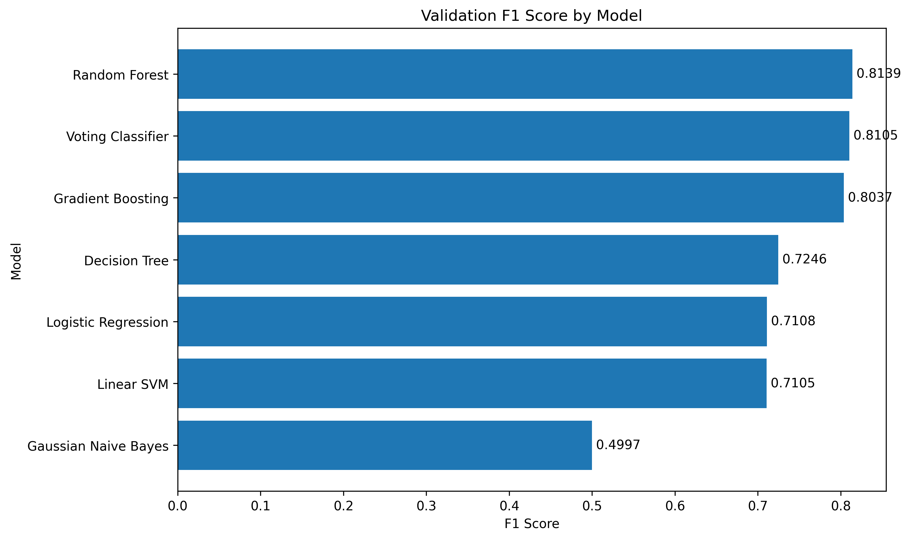
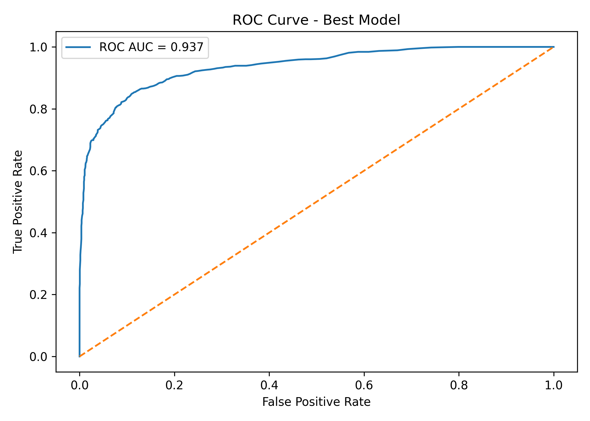
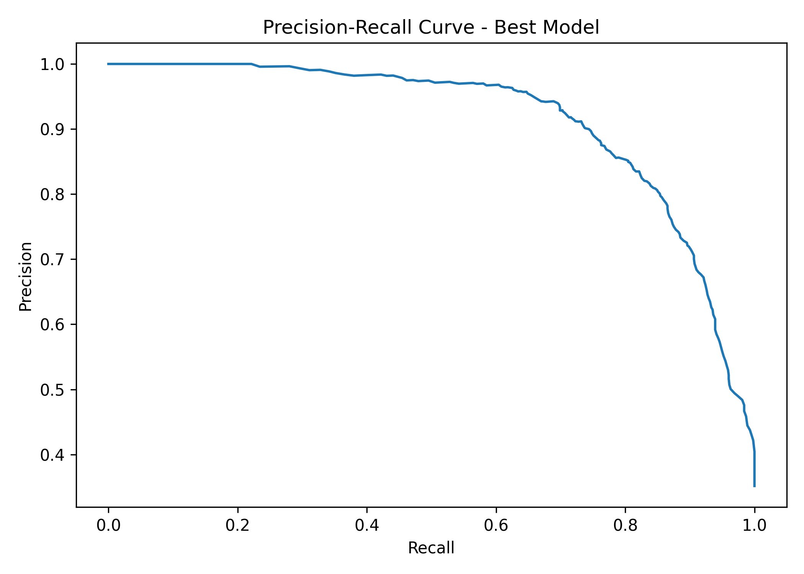

# MAGIC-GAMMA-TELESCOPE-MACHINE-LEARNING-PROJECT
Classifying Cosmic Particle Signals using Supervised Machine Learning: A Comparative Study on the MAGIC Gamma Telescope Dataset

# Project Overview

The MAGIC Gamma Telescope dataset is a binary classification problem where the goal is to distinguish between:

Gamma Rays (g): True high-energy gamma particle signals captured by the telescope
Hadron Events (h): Background noise generated by cosmic hadrons

Accurate classification helps improve telescope signal filtering and supports faster scientific discovery in astrophysics.

This project builds a complete end-to-end machine learning pipeline including data preprocessing, exploratory data analysis, class imbalance handling, model benchmarking, final testing, and performance visualization.

# Objectives

This project answers the following questions:

What is the structure and quality of the dataset?
Is the dataset balanced or imbalanced?
Which features are most informative?
Are there redundant or highly correlated variables?
Which machine learning model performs best?
How accurate is the final model on unseen test data?
How can model performance be improved further?

# Dataset Information
Dataset Name: [MAGIC Gamma Telescope Dataset](https://archive.ics.uci.edu/dataset/159/magic+gamma+telescope)
Task Type: Supervised Machine Learning
Problem Type: Binary Classification
Target Variable: class

| Orginal Label | Encoded | Meaning            |
| ------------- | ------------- | -------------
| g             | 0             | Gamma Signal |
| h             | 1             | Hadron Noise |

# Project Workflow
# A. Data Loading & Cleaning
1. Loaded CSV dataset using Pandas
2. Removed unnecessary columns
3. Encoded target labels (g = 0, h = 1)
4. Checked missing values and data types
# B. Exploratory Data Analysis (EDA)
1. Dataset summary
2. Class distribution analysis
3. Feature histograms
4. Boxplots for outlier detection
5. Correlation heatmap
6. Redundant feature inspection

# C. Handling Class Imbalance
The dataset showed moderate class imbalance:
Gamma: 64.84%
Hadron: 35.16%
To reduce model bias toward the majority class, SMOTE (Synthetic Minority Oversampling Technique) was applied only to the training set.

# D. Data Splitting
Stratified split was used:

70% Training Set
15% Validation Set
15% Test Set

# E. Models Built
The following machine learning models were trained and compared:

1. Logistic Regression
2. Gaussian Naive Bayes
3. Linear SVM
4. Decision Tree
5. Random Forest
6. Gradient Boosting
7. Voting Classifier

# F. Validation Results
| Model | Accuracy | Precision | Recall | F1 Score | ROC AUC |
| ------|----------|-----------|--------|----------|---------|
| Random Forest| 86.82 | 80.83 | 81.95 | 81.39 |93.16     |
| Voting Classifier | 86.54| 80.25 | 81.85 |81.05 | 92.48|
| Gradient Boosting| 86.05 | 79.51| 81.26 | 80.37 | 91.78|
| Decision Tree| 79.78 | 69.51 | 75.67 | 72.46| 78.84    |
| Logistic Regression| 79.36| 70.02 |72.18 |71.08  |83.97|
| Linear SVM |79.64| 71.02| 71.09 | 71.05| 83.99 |
| Gaussian Naive Bayes|71.78|66.34|40.08|49.97|75.63|

# G Best Model Selected:
Random Forest achieved the best validation performance and was selected for final testing.
## Final Test Results

| Best Model     | Accuracy | Precision | Recall | F1 Score | ROC AUC |
|----------------|----------|-----------|--------|----------|---------|
| Random Forest  | 87.14   | 82.25    | 80.86 | 81.55   | 93.33  |

# H. ROC Curve

# I. Precision-Recall Curve

# J. Key Insights

1. Random Forest emerged as the best-performing model across validation and test datasets, achieving the highest balance between accuracy, recall, precision, and F1-score.
2. Ensemble methods consistently outperformed standalone models, showing that combining multiple decision trees improves robustness and generalization on unseen data.
3. SMOTE helped reduce class imbalance bias by synthetically increasing minority-class samples in the training set, improving Hadron detection performance.
4. Feature scaling significantly benefited distance-based and linear algorithms such as Logistic Regression and SVM by bringing all variables to a common range.
5. Gaussian Naive Bayes performed the weakest, suggesting that the dataset does not strongly satisfy the independence assumptions required by Naive Bayes.
6. High ROC AUC score (0.9333) indicates that the final Random Forest model has excellent ability to distinguish Gamma events from Hadron noise.
7. Strong Gamma and Hadron classification scores in the final report confirm that the model performs reliably for both majority and minority classes.

# K. Conclusion
This project successfully built a robust machine learning system to classify Gamma and Hadron particle events using telescope signal data.

After comparing multiple algorithms, Random Forest emerged as the best model with:

|Accuracy |F1 Score| ROC AUC|
|---------|--------|--------|
| 87.14% | 81.55%  | 93.33% |

